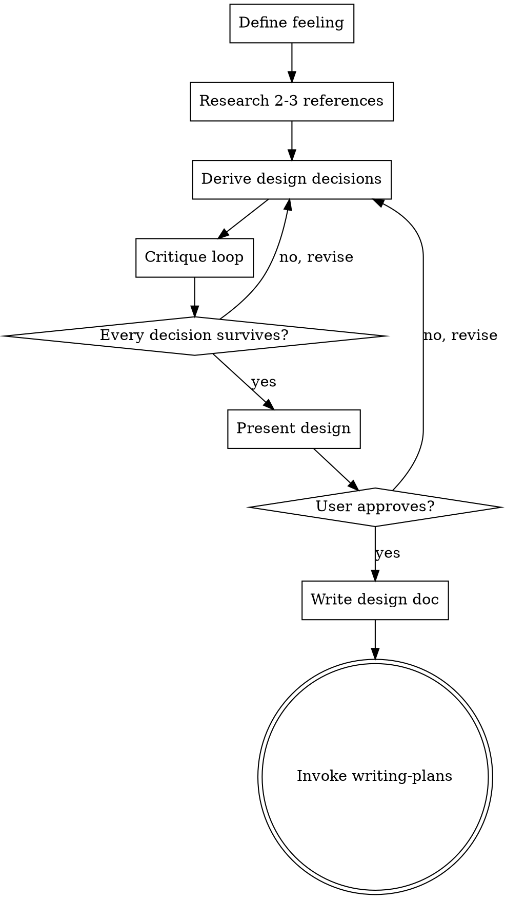

# Design Skill Implementation Plan

> **For Claude:** REQUIRED SUB-SKILL: Use the-controller-executing-plans to implement this plan task-by-task.

**Goal:** Create a standalone UI/UX design skill that enforces feeling-first design with mandatory research, critique loop, and design philosophy.

**Architecture:** Single SKILL.md file in `skills/the-controller-design/`, symlinked to `~/.claude/skills/`. Follows TDD-for-skills process: baseline test → write skill → close loopholes.

**Tech Stack:** Markdown (SKILL.md), shell (symlink setup)

---

### Task 1: RED — Baseline Test Without Skill

**Purpose:** See what an agent does when asked to design UI without the design skill. Document failures to address.

**Step 1: Write the pressure scenario**

Create a test prompt that asks an agent to design a UI component. Use a realistic scenario from The Controller domain:

```
You are working on The Controller, a Tauri v2 + Svelte 5 desktop app for orchestrating Claude Code sessions.

Design the UI for a "session health dashboard" — a view that shows the health/status of all running agent sessions at a glance. Consider layout, interactions, visual treatment, and edge cases.

Present your design.
```

**Step 2: Run baseline with subagent**

Dispatch a subagent (model: sonnet) with the prompt above. Do NOT give it any design skill.

**Step 3: Document baseline behavior**

Record verbatim:
- Did it define a feeling statement? (expected: no)
- Did it research other tools? (expected: no)
- Did it run a critique loop? (expected: no)
- Were visual decisions specific (exact tokens, spacing) or vague ("clean layout")? (expected: vague)
- Did it consider edge cases / states? (expected: partially or no)
- Did it reference The Controller's existing design patterns? (expected: minimally)
- What rationalizations did it use for skipping steps?

**Step 4: Commit baseline results**

```bash
git add docs/plans/2026-03-10-design-skill-baseline.md
git commit -m "test: document design skill baseline behavior"
```

---

### Task 2: GREEN — Write the Skill

**Files:**
- Create: `skills/the-controller-design/SKILL.md`

**Step 1: Write SKILL.md**

The skill must include all content from the design doc (`docs/plans/2026-03-10-design-skill-design.md`):

```markdown
---
name: the-controller-design
description: "Use when you need to design how something should look, feel, and behave — for new UI features, redesigns, or any visual/interaction work before implementation"
---

# Designing User Interfaces

## Overview

Feeling-first UI/UX design. Start from how the experience should feel, research how others solved the problem, derive specific visual and interaction decisions, then critique until every choice earns its place.

<HARD-GATE>
Do NOT skip research. Even for small designs.
Do NOT skip the critique loop.
Do NOT produce implementation code. Writing-plans handles implementation.
Do NOT present a design without a feeling statement.
</HARD-GATE>

## Design Philosophy

### General

**Beauty is alignment.** Form and function so matched the result feels inevitable.

**Elegance is complexity made invisible.** The user feels ease, never the hard problem underneath.

**Craft is invisible detail.** Spacing, transitions, alignment — details nobody notices consciously, but everyone feels. That feeling is trust.

**Restraint is courage.** Stop before the design starts explaining itself.

**Timelessness over trendiness.** Proportion and hierarchy don't age. Trends do.

### The Controller

**Calm control.** Orchestrating agents should feel like conducting — powerful, composed, unhurried. The interface makes complex orchestration feel simple, not hide the complexity.

**The tool disappears.** The best state is when you forget you're using an interface and just work.

**Terminal-native, not terminal-cosplay.** Dense, keyboard-first, no hand-holding. But what terminals would look like if redesigned today.

## Process

You MUST follow these steps in order:

1. **Define the feeling** — One sentence. What should this feel like to use? This is the north star that every subsequent decision is measured against.

2. **Research** — Find 2-3 apps/tools that solve a similar UX problem. Use web search. For each:
   - What it is and what problem it solves
   - What works well and why
   - What doesn't work or wouldn't fit The Controller

3. **Derive the design** — From feeling + research, make specific decisions about:
   - Layout and spatial relationships
   - Information hierarchy (what gets attention first, second, third)
   - Interaction model (keyboard/mouse, transitions)
   - Visual treatment (Catppuccin Mocha tokens, typography, spacing)
   - States (empty, loading, error, populated, edge cases)

4. **Critique loop** — Challenge each decision:
   - Does this serve the feeling?
   - Is there a simpler way?
   - What would you remove and still have it work?
   - Does it feel cohesive with the rest of the app?
   Revise until every decision survives.

5. **Present design** — Walk through section by section, get user approval.

6. **Write design doc** — Save to `docs/plans/YYYY-MM-DD-<topic>-design.md`, commit.

7. **Invoke writing-plans** — Hand off to implementation planning.



**Terminal state is invoking writing-plans.** Do NOT invoke any other skill.

## Design Lenses

Run every design choice through these:

- **Eye movement** — Where does the eye land first? Is that the most important thing?
- **Negative space** — Is the emptiness intentional? Grouping, breathing room, or focus?
- **Visual weight** — Which elements feel heavy? Does weight match hierarchy?
- **Contrast as communication** — Color, size, weight differences tell the user what matters. Saying the right things?
- **Edge cases as design inputs** — 1 item? 50 items? 200-character name? Error? These reveal if the design works.
- **Motion as meaning** — Animation answers "what just happened?" If not, remove it.
- **Density vs. cognitive load** — Dense + flat = overwhelming. Dense + structured = powerful.
- **The glance test** — Half-second view. What do they understand?
- **Consistency as trust** — Same patterns repeating predictably. User stops thinking about the interface.

## Principles

1. **Feeling is the north star** — Every decision traces back to the feeling statement.
2. **Research before inventing** — Always look at how others solved it first.
3. **Coherence with the whole** — New designs must feel like they belong in The Controller.
4. **Remove until it breaks** — Don't ask "is this simple enough?" Ask "what happens if I remove this?" If nothing, remove it.
5. **Specify or it didn't happen** — "Clean layout with good spacing" is worthless. Say which elements, what spacing, which tokens.

## Design Doc Format

```
# <Feature> Design

## Feeling
One sentence.

## Research
For each reference (2-3):
- What it is
- What works and why
- What doesn't or wouldn't fit

## Design

### Layout
Spatial relationships, positioning, sizing.

### Hierarchy
What gets attention first. Typography, color, spacing.

### Interactions
Keyboard, mouse, transitions, animations.

### Visual Treatment
Catppuccin Mocha tokens, spacing values, typography.

### States
Empty, loading, populated, error, edge cases.

## Critique
Decisions challenged and why they survived. What was removed.
```

Scaled to complexity.

## Red Flags — STOP and Revise

- Designing without a feeling statement
- No research references cited
- Vague specs ("good spacing", "clean layout", "nice colors")
- Skipping states (empty, error, loading)
- No critique section in the design doc
- Copying a reference wholesale instead of synthesizing
```

**Step 2: Verify file exists and frontmatter is valid**

```bash
head -5 skills/the-controller-design/SKILL.md
```

Expected: YAML frontmatter with name and description.

**Step 3: Commit**

```bash
git add skills/the-controller-design/SKILL.md
git commit -m "feat: add the-controller-design skill"
```

---

### Task 3: Set Up Symlink

**Step 1: Create symlink**

```bash
ln -s /Users/noel/projects/the-controller/skills/the-controller-design /Users/noel/.claude/skills/the-controller-design
```

Note: This links from the main repo, not the worktree. The worktree files will be merged to master first.

**Step 2: Verify symlink**

```bash
ls -la /Users/noel/.claude/skills/the-controller-design
```

Expected: symlink pointing to `/Users/noel/projects/the-controller/skills/the-controller-design`

**Step 3: Commit** (nothing to commit — symlink is outside repo)

---

### Task 4: GREEN — Test With Skill

**Step 1: Run the same pressure scenario from Task 1 with a subagent that has the skill loaded**

Same prompt:

```
You are working on The Controller, a Tauri v2 + Svelte 5 desktop app for orchestrating Claude Code sessions.

Design the UI for a "session health dashboard" — a view that shows the health/status of all running agent sessions at a glance. Consider layout, interactions, visual treatment, and edge cases.

Present your design.
```

But this time, include the skill content in the subagent's context.

**Step 2: Verify compliance**

Check against baseline failures:
- [ ] Did it define a feeling statement? (required: yes)
- [ ] Did it research other tools? (required: yes)
- [ ] Did it run a critique loop? (required: yes)
- [ ] Were visual decisions specific? (required: yes — exact tokens, spacing values)
- [ ] Did it consider all states? (required: yes — empty, loading, error, populated)
- [ ] Did it reference The Controller's design patterns? (required: yes)

**Step 3: Document results**

Save comparison (baseline vs. with-skill) to `docs/plans/2026-03-10-design-skill-test-results.md`.

**Step 4: Commit**

```bash
git add docs/plans/2026-03-10-design-skill-test-results.md
git commit -m "test: document design skill GREEN test results"
```

---

### Task 5: REFACTOR — Close Loopholes

**Step 1: Identify gaps from Task 4**

Review the with-skill test results. Look for:
- New rationalizations the agent used to skip steps
- Steps it followed superficially (e.g., "research" that's just listing apps without analysis)
- Vague specs that slipped through despite the "specify or it didn't happen" principle
- Any hard gate violations

**Step 2: Update SKILL.md to address gaps**

Modify: `skills/the-controller-design/SKILL.md`

Add explicit counters for any rationalizations found. Add to Red Flags if needed.

**Step 3: Re-test with another subagent**

Use a different design scenario to avoid memorization:

```
You are working on The Controller, a Tauri v2 + Svelte 5 desktop app for orchestrating Claude Code sessions.

Design the UI for an "agent conversation preview" — when hovering or focusing an agent session in the sidebar, show a preview of the current conversation state without switching to that session.

Present your design.
```

**Step 4: Verify all checklist items pass**

Same checklist as Task 4 Step 2.

**Step 5: Commit**

```bash
git add skills/the-controller-design/SKILL.md
git commit -m "refactor: close loopholes in design skill"
```

---

### Task 6: Final Verification and Cleanup

**Step 1: Word count check**

```bash
wc -w skills/the-controller-design/SKILL.md
```

Target: under 500 words (per writing-skills guidance for non-frequently-loaded skills). If over, trim without losing essential content.

**Step 2: Clean up test artifacts**

The baseline and test result docs can stay in `docs/plans/` as reference, or be removed if they served their purpose. User's choice.

**Step 3: Final commit**

```bash
git add -A
git commit -m "chore: finalize design skill"
```
