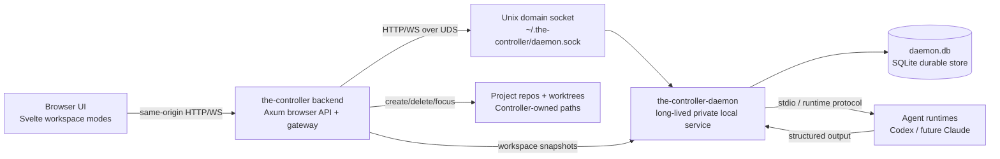
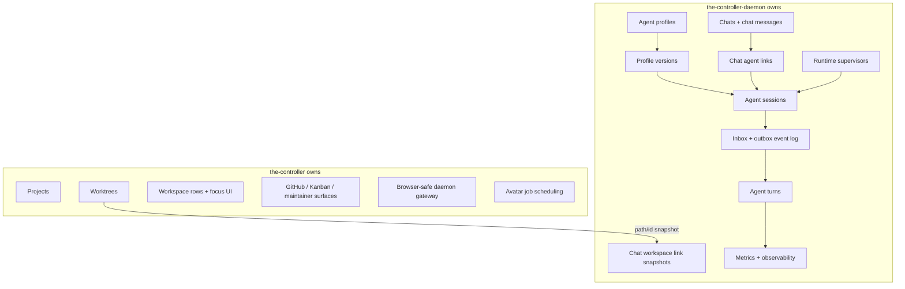
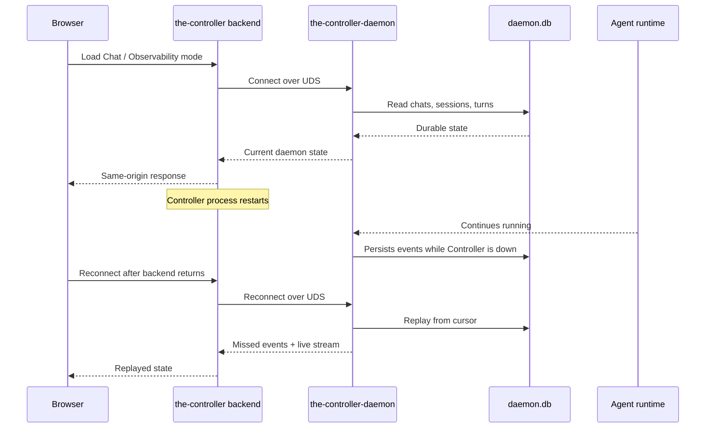
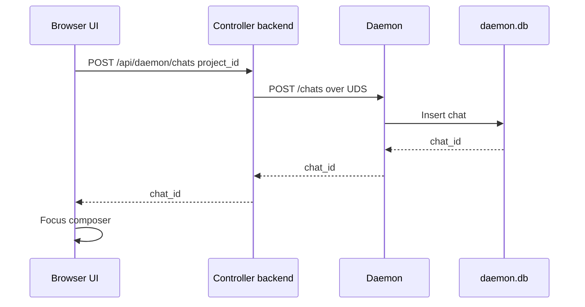
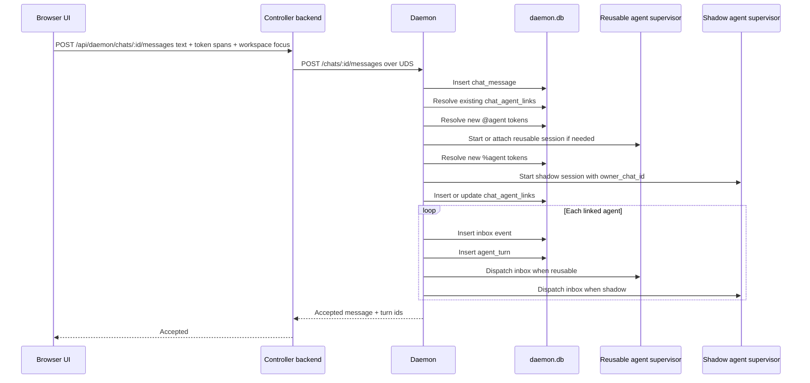
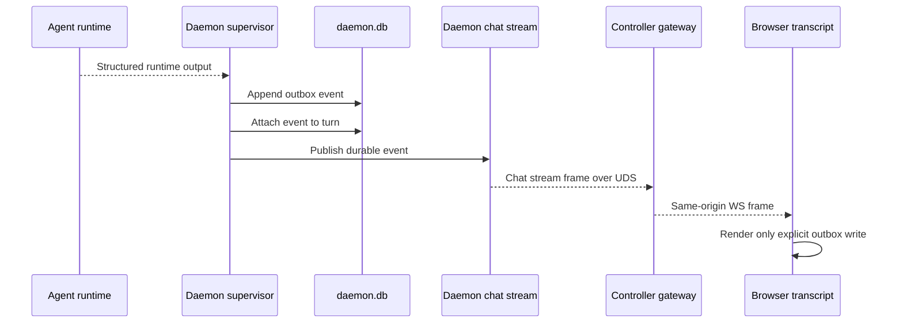
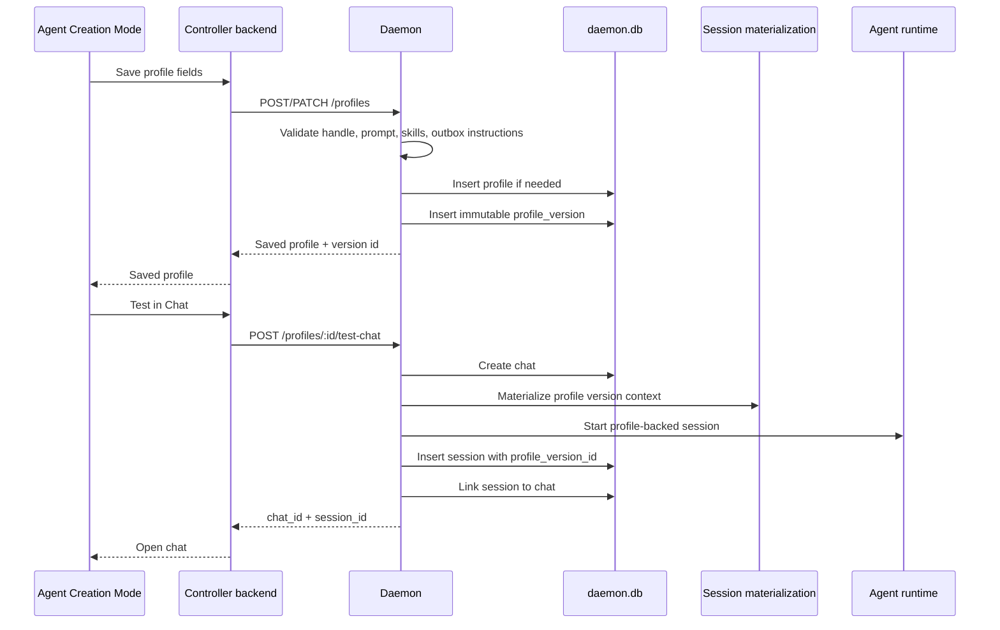
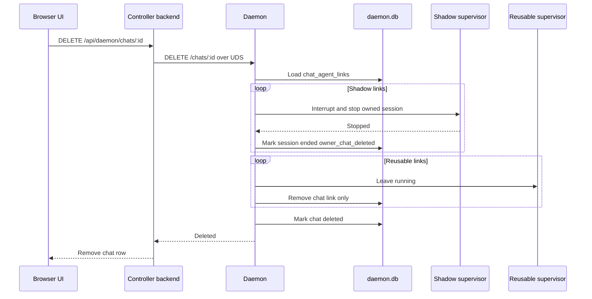
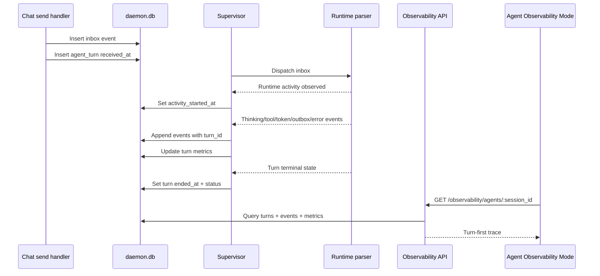

# Agent Architecture Design

Date: 2026-04-29
Status: Draft

Related docs:

- `docs/plans/2026-04-29-chat-routing-prd.md`
- `docs/plans/2026-04-29-agent-creation-prd.md`
- `docs/plans/2026-04-29-agent-observability-prd.md`
- `docs/plans/2026-04-29-controller-agent-product-prd.md`
- `docs/plans/2026-04-27-controller-chat-modes-daemon-rfc.md`
- `docs/domain-knowledge.md`

## Task Structure

### Definition

Design the target architecture for `the-controller` and
`the-controller-daemon` so they can support:

1. Chat Routing Mode.
2. Agent Creation Mode.
3. Agent Observability Mode.

The design should keep the daemon long-lived across Controller restarts while
making the Controller backend the only browser-facing service.

### Constraints

- No backwards compatibility or old-data migration is required.
- The daemon and Controller backend run on the same machine.
- The daemon is a separate long-lived process.
- The daemon should use Unix domain socket transport only.
- No daemon TCP fallback is required.
- No daemon bearer token is required in the target architecture.
- Browser JavaScript must not know daemon transport details.
- `the-controller` owns projects, repositories, worktrees, workspace rows, and
  workspace filesystem operations.
- `the-controller-daemon` owns profiles, profile versions, chats, routing,
  agent sessions, inbox/outbox events, turns, metrics, and observability.
- Workspace links stored in the daemon are Controller-provided snapshots, not
  daemon-owned workspace objects.
- Chat transcripts render user messages and explicit agent outbox writes only.
- Runtime stdout is diagnostic input to the daemon, not product chat output.
- Axum request handlers that do blocking process, filesystem, or git work must
  offload that work instead of blocking tokio reactor threads.

### Validation

The architecture is implemented when tests can prove:

- Controller restart does not stop daemon sessions.
- Daemon restart preserves chats, links, sessions, events, turns, and pending
  inbox items.
- Browser code calls only same-origin Controller routes.
- Controller backend talks to the daemon over a Unix socket.
- `@agent` links reusable sessions that survive chat deletion.
- `%agent` creates shadow sessions on send and stops them on chat deletion.
- One chat send fans out to one inbox item and one turn per linked agent.
- Chat transcript rendering excludes raw runtime output.
- Observability can replay by chat, agent session, and turn.

## Summary

Use two separate local services:

- `the-controller`: browser-facing Axum + Svelte app, project/workspace owner,
  and same-origin daemon gateway.
- `the-controller-daemon`: long-lived local service, private Unix socket API,
  agent runtime owner, durable chat/routing/profile/observability store.

The boundary is:

> Controller owns workspace reality. Daemon owns agent reality. Chat routing is
> the bridge, owned by the daemon but carrying Controller workspace references.

## System Topology



The daemon remains running when `the-controller` restarts. The Controller
backend reconnects to the daemon socket after restart and replays durable
daemon state to the browser.

## Ownership Boundary



The daemon can remember a workspace link, but it cannot create, delete, rename,
or migrate a Controller worktree. When workspace state changes, the Controller
performs the filesystem/project operation and sends the daemon a new snapshot.

## Component Design

### Browser UI

Responsibilities:

- Render Chat Routing Mode, Agent Creation Mode, and Agent Observability Mode.
- Use same-origin Controller routes only.
- Keep no daemon socket path, token, port, or transport-specific code.
- Maintain local draft UI state for composer text and pending token spans.
- Render transcripts from daemon chat transcript APIs.
- Render observability from daemon turn/metrics APIs.

Key frontend modules should move toward:

- `src/lib/daemon/client.ts`: same-origin gateway client, not direct daemon
  client.
- `src/lib/daemon/store.svelte.ts`: daemon state cache backed by gateway calls.
- `src/lib/chat/*`: chat routing UI, composer token suggestions, transcript.
- new profile UI modules for Agent Creation Mode.
- new observability UI modules for Agent Observability Mode.

### Controller Backend

Responsibilities:

- Own project storage, repo paths, worktrees, and workspace lifecycle.
- Expose same-origin browser APIs.
- Start or discover the daemon when daemon-backed modes need it.
- Reconnect to an already-running daemon after Controller restart.
- Proxy daemon HTTP and WebSocket APIs over the Unix socket.
- Hide daemon transport details from browser JavaScript.
- Send workspace snapshots to the daemon after Controller-owned workspace
  operations.
- Schedule profile avatar jobs if avatar generation stays outside daemon
  runtime materialization.

The Controller backend should not own agent session state, chat fan-out,
profile versioning, or observability facts.

### Daemon API Server

Responsibilities:

- Listen on `~/.the-controller/daemon.sock`.
- Own the daemon API route surface.
- Enforce local request validation and product invariants.
- Write durable records before publishing live events.
- Serve replayable HTTP reads and WebSocket streams over the same socket.
- Keep running independently of the Controller process.

No target-state TCP listener or bearer token is required.

### Daemon Stores

The daemon should use a fresh schema built around these domains:

- profiles and profile versions;
- chats and routing links;
- sessions and supervisor state;
- event log;
- turns and metrics.

Suggested tables:

```text
agent_profiles
agent_profile_versions
agent_profile_skills
agent_profile_assets

chats
chat_messages
chat_agent_links
chat_workspace_links
chat_outbox_links

sessions
events
agent_turns
turn_events
turn_metrics
```

Aggregate metric tables can wait until query cost demands them. The first
implementation can compute chat and agent summaries from events, turns, and
turn metrics.

### Runtime Supervisors

Each live session has a daemon-owned supervisor group:

- dispatcher: reads unapplied inbox events and sends runtime commands;
- reader/parser: reads structured runtime output and appends normalized events;
- status watcher: records lifecycle state, crash, interruption, and exit;
- turn tracker: attaches runtime events to the current agent turn.

The supervisor never streams raw terminal bytes to the browser.

## Data Model

### Profiles

Profiles are stable user-facing definitions. Versions are immutable launch
snapshots.

Required fields:

- profile id;
- active handle;
- display name;
- description;
- archive state;
- avatar asset/status fields;
- created/updated timestamps.

Profile version fields:

- version id;
- profile id;
- runtime;
- model/provider settings where applicable;
- prompt;
- skills;
- default workspace behavior;
- outbox instructions;
- validation result;
- created timestamp.

Every successful save creates a new version. Running and historical sessions
keep the `profile_version_id` used at launch.

### Sessions

Sessions are daemon-owned runtime processes.

Required fields:

- session id;
- label;
- runtime;
- profile id and profile version id where profile-backed;
- session kind: `raw`, `reusable`, or `shadow`;
- owner chat id for shadow sessions;
- current status;
- native runtime session id;
- process metadata;
- launch context snapshot;
- created/updated/ended timestamps.

### Chats And Routing

Chats are daemon-owned conversation/routing containers.

Required fields:

- chat id;
- Controller project id;
- title;
- created/updated/deleted timestamps.

Chat messages store user-authored messages. They should include a stable
client-provided idempotency id when available.

Chat agent links record:

- chat id;
- session id;
- profile id;
- profile version id;
- route type: `reusable` or `shadow`;
- focus state;
- token source: `@agent`, `%agent`, or API-created;
- created timestamp.

Chat workspace links record Controller snapshots:

- chat id;
- Controller project id;
- Controller workspace id;
- absolute path snapshot;
- label/name snapshot;
- branch snapshot when known;
- focused flag;
- created/updated timestamps.

### Events, Turns, And Metrics

Events remain append-only per session:

```text
session_id
seq
channel: inbox | outbox | system
kind
payload
created_at
applied_at
turn_id
chat_id
```

Turns are created at inbox fan-out time:

```text
turn_id
session_id
chat_id
chat_message_id
inbox_seq
status
received_at
activity_started_at
ended_at
```

Turn events and metrics attach runtime activity to that turn. When a runtime
does not expose a field, the daemon stores it as unavailable or omits it. It
does not invent hidden reasoning, token counts, or status details.

## API Shape

The browser calls Controller routes:

```text
/api/daemon/profiles...
/api/daemon/chats...
/api/daemon/sessions...
/api/daemon/observability...
```

The Controller backend forwards those requests over the daemon Unix socket.
Route names exposed by the Controller should mirror daemon product routes where
possible to reduce adapter code.

Daemon routes:

```text
GET    /profiles
POST   /profiles
GET    /profiles/:id
PATCH  /profiles/:id
POST   /profiles/:id/archive
POST   /profiles/:id/restore
POST   /profiles/:id/test-chat

GET    /chats
POST   /chats
GET    /chats/:id
DELETE /chats/:id
POST   /chats/:id/messages
GET    /chats/:id/transcript
GET    /chats/:id/stream
POST   /chats/:id/agent-links
POST   /chats/:id/workspace-links
PATCH  /chats/:id/workspace-links/:link_id/focus

GET    /sessions
GET    /sessions/:id
DELETE /sessions/:id
GET    /sessions/:id/events
GET    /sessions/:id/stream
POST   /sessions/:id/interrupt

GET    /observability/agents
GET    /observability/agents/:session_id
GET    /observability/turns/:turn_id
GET    /observability/chats/:chat_id/metrics
```

Workspace-link request body:

```json
{
  "project_id": "controller-project-id",
  "workspace_id": "controller-workspace-id",
  "path": "/absolute/path/to/worktree",
  "label": "controller-chat-routing",
  "branch": "codex/chat-routing",
  "focused": true
}
```

## Interaction Diagrams

### Controller Restart With Long-Lived Daemon



### New Chat



No agent session is required to create a chat.

### Sending A Message With Fan-Out



Fan-out happens inside the daemon. If the browser disconnects after send, the
daemon still owns delivery and turn creation.

### Outbox To Transcript



Raw runtime stdout can be retained for diagnostics, but it is not a chat reply.

### Profile Save And Test Chat



Unsaved profile edits never affect a test chat. Only saved profile versions can
launch sessions.

### Shadow Chat Deletion Cleanup



Shadow sessions are owned by the chat. Reusable sessions are not.

### Observability Turn Flow



Observability is a projection over durable daemon facts, not a separate log
scraped from terminal output.

## Error Handling

### Controller Gateway Errors

- Daemon socket missing.
- Daemon lockfile says running but socket is unreachable.
- Daemon unavailable during request.
- Daemon schema/API incompatible with Controller build.
- Gateway stream drops during replay or live streaming.

Mode-level daemon failures should render as mode-level status panels. They
should not create fake chat transcript messages.

### Daemon Routing Errors

- Profile handle missing.
- Profile archived.
- Profile validation failed.
- Runtime binary unavailable.
- Reusable session spawn failed.
- Shadow session spawn failed.
- No agent linked when sending a message.
- Workspace snapshot path no longer exists.
- Workspace context reload failed.
- Shadow cleanup failed during chat deletion.

Errors should appear near the action that caused them: composer, token
suggestion, profile form, chat deletion action, workspace picker, or
observability detail panel.

## Target-State Cutover

No backwards compatibility or migration layer is needed. The implementation can
replace early daemon and frontend assumptions directly:

- Replace TCP daemon server with UDS-only server.
- Remove daemon bearer-token product path.
- Remove `/api/read_daemon_token`.
- Replace direct frontend daemon client with same-origin Controller gateway.
- Replace mutable profile rows with profile plus immutable version rows.
- Replace session-only chat mode with daemon-owned chats and routing.
- Replace transcript-from-session thinking with transcript-from-chat outbox
  projection.
- Add turns as first-class observability records.

## Implementation Phases

### Phase 1: Daemon Foundation

- UDS-only daemon server.
- Fresh schema for profiles, profile versions, chats, links, sessions, events,
  turns, and metrics.
- Independent daemon process with pidfile/lockfile.
- Controller can discover/start daemon but does not own daemon lifetime.

### Phase 2: Controller Gateway

- Controller backend proxies daemon HTTP and WS over UDS.
- Browser calls only `/api/daemon/...`.
- Frontend removes daemon URL, token, and transport knowledge.

### Phase 3: Profiles

- Versioned profile CRUD.
- Handle semantics.
- Archive and restore.
- Validation.
- Profile launch metadata and `Test in Chat`.

### Phase 4: Chats And Routing

- Daemon-owned chat create/send/delete.
- `@agent` reusable linking.
- `%agent` shadow creation on send.
- Inbox fan-out inside daemon.
- Chat deletion cleanup for owned shadow sessions.

### Phase 5: Observability

- First-class turns.
- Runtime events attach to turns.
- Chat metrics and agent observability APIs.
- Turn-first UI surface.

### Phase 6: UI Surfaces

- Chat Routing Mode.
- Agent Creation Mode.
- Agent Observability Mode.
- Existing Controller project/workspace/Kanban behavior remains
  Controller-owned.

## Validation Plan

### Daemon Tests

- Storage tests for profiles, profile versions, chats, links, sessions, events,
  turns, and metrics.
- API tests for chat create, send, stream, and delete.
- Fan-out tests proving one chat message creates one inbox item and one turn per
  linked agent.
- `@agent` tests proving reusable sessions remain after chat deletion.
- `%agent` tests proving shadow sessions start on send and stop on chat
  deletion.
- Observability tests proving turn events replay by chat, session, and turn.
- Recovery tests proving daemon restart preserves chats, links, pending inbox,
  turns, and shadow ownership.

### Controller Backend Tests

- Gateway HTTP tests over Unix socket.
- Gateway WebSocket tests for replay and reconnect.
- Lifecycle tests for daemon missing, daemon already running, daemon restart,
  and Controller restart.
- Tests proving browser endpoints never expose daemon socket paths or transport
  details.

### Frontend Tests

- Composer-first new chat tests.
- `@` and `%` token suggestion tests.
- Multi-agent send-flow tests.
- Transcript tests proving only user messages and outbox writes render.
- Profile editor tests for versioned save, archive, restore, and test chat.
- Observability page tests for turn-first rendering.

### End-to-End Tests

- Create profile, create chat, link `@agent`, send message, receive outbox, and
  inspect metrics.
- Create `%agent`, send message, delete chat, and verify shadow session cleanup.
- Restart Controller while daemon runs and verify chat/session history remains.
- Restart daemon and verify persisted chat, session, event, and turn history
  replays.
