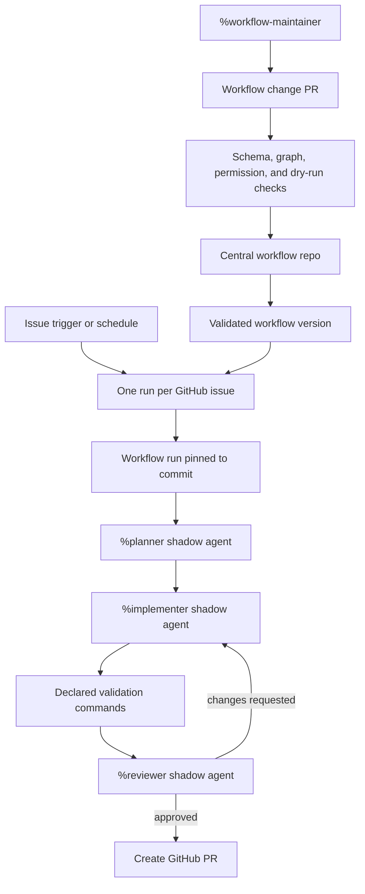

# PRD: Agent Workflow Engine

Date: 2026-04-30
Status: Draft

Related docs:

- `docs/plans/2026-04-29-controller-agent-product-prd.md`
- `docs/plans/2026-04-29-chat-routing-prd.md`
- `docs/plans/2026-04-29-agent-creation-prd.md`
- `docs/plans/2026-04-29-agent-observability-prd.md`

## Table of Contents

- [Summary](#summary)
- [Design Assets](#design-assets)
- [Problem](#problem)
- [Goals](#goals)
- [Non-goals](#non-goals)
- [Users](#users)
- [Core Decisions](#core-decisions)
- [Core Concepts](#core-concepts)
- [Use Cases](#use-cases)
- [Workflow Definition](#workflow-definition)
- [Triggers](#triggers)
- [Workflow Graph](#workflow-graph)
- [Agent Nodes](#agent-nodes)
- [System Nodes](#system-nodes)
- [Scheduling and Run Lifecycle](#scheduling-and-run-lifecycle)
- [Validation Model](#validation-model)
- [Workflow Repository and Versioning](#workflow-repository-and-versioning)
- [Agent-Authored Workflow Changes](#agent-authored-workflow-changes)
- [Frontend UX Requirements](#frontend-ux-requirements)
- [Backend and Daemon Requirements](#backend-and-daemon-requirements)
- [Observability Requirements](#observability-requirements)
- [Error States](#error-states)
- [Acceptance Criteria](#acceptance-criteria)
- [Metrics](#metrics)
- [Open Questions](#open-questions)
- [Proposed Phases](#proposed-phases)

## Summary

The Controller should let users define reusable agent workflows that operate on
GitHub issues. A workflow combines triggers, filters, a graph of agent and
system nodes, prompt instructions, validation commands, and run policy.

For v1, workflows focus on issues that need agents to create pull requests. A
trigger creates one workflow run per GitHub issue. Each run pins a workflow
version, creates persistent shadow agents for the roles it needs, executes graph
nodes in order, validates progress with declared checks, and creates a pull
request when the work is ready.

Workflows are source-controlled text files in a central workflow repository.
The graphical editor reads and writes those files. Agents may also modify
workflow definitions. Agent-authored changes are applied automatically through a
validated branch-and-PR flow: The Controller opens a PR in the central workflow
repo, validates the definition, auto-merges it when checks pass, and activates
the new workflow version for future runs.

## Design Assets

- [Workflow Creation Mode mockup](../assets/design/controller-workflow-creation-ui.png)



## Problem

The Controller can already orchestrate terminal sessions and is gaining chat,
agent creation, and observability surfaces. It does not yet have a product model
for repeatable, multi-agent work over many GitHub items.

Users want to define a GitHub issue workflow once, then let The Controller run
it across matching issues. For example, a user might define this workflow for
turning eligible issues into pull requests:

```text
plan agent -> UI agent if needed -> implementation agent -> test agent
  -> review agent -> implementation agent until review passes
  -> create PR
```

The hard part is not only spawning agents. The Controller must decide when each
agent or system action should run, preserve context across loopbacks, validate
that work is complete, and give users a UI that makes the workflow graph easy to
inspect and edit.

## Goals

1. Define user-authored workflows for GitHub issue automation.
2. Support triggers such as new issue, schedule, and manual run.
3. Create one workflow run per GitHub item.
4. Use persistent per-run shadow agents for agent nodes.
5. Support both agent nodes and deterministic system nodes.
6. Inject node instructions into the prompt/context sent to shadow agents.
7. Validate node completion with declared commands and GitHub checks in v1.
8. Store workflow definitions as text files in a central Git repository.
9. Let agents modify workflows automatically through validated PRs.
10. Provide a graphical editor for adding, removing, connecting, and inspecting
    graph nodes.
11. Keep workflow runs observable through the existing agent observability model.

## Non-goals

- Existing PR remediation workflows in v1.
- Fully autonomous merging to the target repository in v1.
- LLM judge-based validation as a required v1 gate.
- A general-purpose Zapier-style automation platform.
- Multi-user approval workflows.
- Running one workflow run over a batch of GitHub items.
- Defining the final workflow file syntax in this PRD.
- Replacing chat routing or agent creation.

## Users

### Agent Orchestrator

Defines workflows that coordinate planners, implementers, testers, reviewers,
and system steps. They need graph editing, source-controlled workflow changes,
and confidence that agents cannot silently skip validation.

### Repository Maintainer

Owns one or more GitHub repositories. They want new issues to enter a controlled
agent pipeline only when workflow triggers and filters match.

### Workflow Maintainer Agent

A shadow agent or reusable agent that improves workflow definitions. It needs a
text format it can edit, automatic activation after validation, and an audit
trail for every workflow change.

### Interactive Developer

Watches workflow runs, opens linked chats when intervention is needed, and
inspects why a run is blocked, retried, or complete.

## Core Decisions

1. Workflows are user-defined. The Controller ships capabilities, not a single
   hardcoded issue workflow.
2. Workflow definitions live in a central workflow Git repository.
3. The graphical editor is a projection over the workflow text definition.
4. Trigger execution creates one workflow run per GitHub item.
5. V1 runs operate on GitHub issues that need agents to create PRs.
6. Shadow agents are the agent execution primitive for workflow nodes. They use
   the shadow-agent semantics from the Chat Routing PRD.
7. Shadow agents persist for the lifetime of a workflow run, scoped by role.
8. The graph supports agent nodes and system nodes.
9. Agent nodes receive node instructions through prompt/context injection.
10. V1 validation uses declared commands and platform checks.
11. Agent-authored workflow edits are applied automatically through validated
    PRs against the central workflow repo.

## Core Concepts

### Workflow

A named, versioned definition that declares triggers, filters, graph nodes,
edges, run policy, permissions, and validation requirements.

### Workflow Definition File

A schema-backed text file in the central workflow repo. The UI and agents both
edit this file. The exact format can be YAML or JSON; v1 should choose one
schema and generate stable formatting so diffs stay readable.

### Workflow Version

An immutable reference to a validated workflow definition at a specific Git
commit. Every run pins the version that launched it.

### Workflow Trigger

A rule that decides when The Controller should evaluate a workflow. Examples:
new issue, scheduled scan, manual run, or issue label change.

### Workflow Run

One execution of a workflow version for one GitHub item. A scheduled trigger may
fan out to many issues, but each issue gets its own run.

### Node

One step in the workflow graph. Nodes are either agent nodes or system nodes.

### Agent Node

A node executed by a persistent shadow agent for the workflow run. It includes
role, profile, prompt instructions, required outputs, validation commands,
timeouts, retries, and permissions.

### System Node

A deterministic Controller-owned action such as fetching GitHub metadata,
creating a branch, waiting for CI, creating a PR, posting a comment, applying a
label, or evaluating a condition.

### Role Shadow Agent

A shadow agent session created for one workflow run and one role, such as
planner, implementer, tester, or reviewer. The same role agent receives later
tasks when the graph loops back.

### Declared Validation

Checks listed in the workflow definition. V1 examples include `pnpm test`,
`cargo test`, `pnpm check`, required artifact checks, diff constraints, and
GitHub state checks.

## Use Cases

### Run a Workflow When a New Issue Is Filed

The user defines a workflow with a `github.issue.opened` trigger and filters for
repo, labels, and issue state. When a matching issue appears, The Controller
creates one workflow run for that issue, pins the active workflow version, and
starts the graph.

### Scheduled Issue Sweep

The user defines a schedule that scans eligible repositories every hour. The
trigger discovers issues matching the workflow filters and creates one run per
issue that is not already running or complete for the active workflow version.

### Plan, Implement, Validate, and Create a PR

The graph runs a planner agent, then an implementation agent. The implementation
agent works in a target worktree and reports the files changed and validation it
ran. The engine then runs declared validation commands. If validation passes, a
system node creates a GitHub pull request linked to the source issue.

### Review Loop

After implementation and validation, a reviewer agent inspects the diff and
comments in structured output. If review requires changes, the graph loops back
to the implementation node. Because the implementation shadow agent persists for
the workflow run, it keeps context from earlier implementation work.

### Agent Improves a Workflow

A workflow-maintainer agent edits the central workflow repo to refine a prompt,
add a validation command, or change graph edges. The Controller opens a branch
and PR, validates the workflow definition, auto-merges the PR if checks pass,
and activates the new version for future runs.

### User Edits Workflow Graphically

The user opens Workflow Creation Mode, drags a new system node between
implementation and PR creation, configures its command, and saves. The text
definition updates with stable formatting. The Controller validates the graph
before activation.

## Workflow Definition

The workflow definition should be legible to humans and agents. It should favor
stable ids, explicit edges, and explicit validation over inferred behavior.

Illustrative shape:

```yaml
id: issue-to-pr
name: Issue to PR
version: 1

triggers:
  - type: github.issue.opened
    filters:
      repos: ["owner/app"]
      labels: ["agent:ready"]
  - type: schedule
    cron: "*/30 * * * *"
    filters:
      repos: ["owner/app"]
      labels: ["agent:ready"]

run:
  item: github.issue
  max_parallel_runs: 4
  max_loop_iterations: 3
  timeout_minutes: 180

nodes:
  plan:
    type: agent
    role: planner
    profile: planner
    instructions: |
      Read the issue, inspect the repo, and produce an implementation plan.
    outputs:
      required:
        - plan_markdown

  implement:
    type: agent
    role: implementer
    profile: implementer
    instructions: |
      Implement the approved plan in the assigned worktree.
    validation:
      commands:
        - pnpm test
        - cd server && cargo test

  review:
    type: agent
    role: reviewer
    profile: reviewer
    instructions: |
      Review the diff and decide whether changes are required.
    outputs:
      required:
        - decision

  create_pr:
    type: system
    action: github.create_pr

edges:
  - from: plan
    to: implement
  - from: implement
    to: review
  - from: review
    to: implement
    when: outputs.review.decision == "changes_requested"
  - from: review
    to: create_pr
    when: outputs.review.decision == "approved"
```

This example is not the final schema. The implementation design should define
the exact field names, expression language, and schema validation.

## Triggers

V1 trigger types:

- `github.issue.opened`: starts a run when a new issue matches filters.
- `schedule`: scans for matching issues and fans out one run per eligible item.
- `manual`: lets the user start a run for a selected issue from the UI.

Later trigger types:

- issue label added or removed;
- issue assigned;
- pull request opened or updated;
- CI status changed;
- workflow repo changed.

Trigger requirements:

1. Triggers must apply filters before creating runs.
2. A trigger must not create duplicate active runs for the same workflow version
   and GitHub item.
3. Scheduled triggers must produce one run per item, not one batch run.
4. Trigger decisions must be observable: matched, filtered out, duplicate, or
   run created.
5. Trigger permissions must be explicit in the workflow definition.

## Workflow Graph

The graph describes the allowed execution path. The engine should support:

- sequential edges;
- conditional edges;
- loopbacks with max iteration limits;
- parallel branches when dependencies allow;
- join nodes after parallel branches;
- disabled nodes for draft workflow editing;
- graph validation before activation.

Graph validation should reject:

- missing start node;
- unreachable nodes unless marked disabled;
- cycles without a loop limit;
- edges that reference unknown nodes;
- conditions that reference unavailable outputs;
- agent nodes without profile or role;
- system nodes without action;
- validation commands that exceed allowed permissions;
- triggers without filters in repositories where broad triggers are disallowed.

## Agent Nodes

Agent nodes execute through persistent role shadow agents. The workflow engine
should create or reuse the role agent for the run, then deliver a node task to
that agent.

The prompt/context sent to the agent should include:

- workflow id, version, run id, node id, and role;
- target GitHub issue URL and metadata;
- target repository and worktree path;
- prior node outputs and artifacts;
- node-specific instructions from the workflow definition;
- required outputs and output schema;
- declared validation commands for this node;
- permissions and forbidden actions;
- loop count and retry context;
- instructions to publish structured completion evidence.

Agent node completion should require structured output. At minimum:

- status: `completed`, `blocked`, or `failed`;
- summary of work performed;
- artifacts produced;
- files changed when applicable;
- validation evidence the agent ran or expects the engine to run;
- open questions or blockers;
- next recommended edge when the graph allows multiple choices.

The engine should not treat an agent's self-report as sufficient validation
when declared validation exists. The self-report gives context; declared checks
decide whether the node can advance.

## System Nodes

System nodes run Controller-owned actions. V1 should include a small set:

- fetch GitHub issue metadata;
- create or update a target worktree;
- create implementation branch;
- run declared command;
- create GitHub PR;
- post GitHub issue or PR comment;
- apply or remove GitHub labels;
- wait for GitHub CI status;
- evaluate a condition over prior outputs.

System node requirements:

1. System nodes must have explicit permissions.
2. System node inputs must come from workflow context, node config, or prior
   outputs.
3. System node outputs must enter the run artifact store.
4. Failed system nodes must produce structured error events.
5. Retrying a system node must be idempotent where possible.

## Scheduling and Run Lifecycle

The scheduler owns readiness decisions. A node becomes runnable when:

1. the run is active;
2. all upstream dependencies are satisfied;
3. its edge condition evaluates true;
4. loop and retry limits allow it;
5. required resources are available;
6. no conflicting node owns the same exclusive resource.

Run states:

- `queued`: run created, waiting for resources;
- `preparing`: worktree, branch, and shadow agents are being prepared;
- `running`: at least one node is active;
- `waiting`: waiting for CI, schedule, resource, or external state;
- `blocked`: needs user intervention or missing permission;
- `failed`: cannot continue;
- `completed`: graph reached a terminal success node;
- `cancelled`: user or policy stopped the run.

Node states:

- `pending`;
- `ready`;
- `running`;
- `validating`;
- `succeeded`;
- `failed`;
- `blocked`;
- `skipped`;
- `cancelled`.

The scheduler should persist every state transition. Browser refreshes and
backend restarts must not lose active run state.

## Validation Model

V1 validation should use declared commands and platform checks. The engine
should run validation after agent nodes that declare it, and before any edge
that requires validated work.

Validation check types:

- shell command in the target worktree;
- GitHub CI status;
- required file or artifact exists;
- no forbidden file changed;
- branch has commits;
- PR exists and links to the issue;
- issue or PR label state matches expectation.

Validation requirements:

1. Checks run from a known working directory.
2. Commands have timeouts.
3. The engine captures exit code, stdout/stderr summary, duration, and command.
4. Secrets and tokens are redacted from validation output.
5. Validation results become durable run artifacts.
6. Failed validation routes through configured failure edges or retry policy.
7. A run cannot complete only because an agent says it is complete.

Agents may report additional validation they performed. The engine should store
that report, but v1 graph advancement should depend on declared checks.

## Workflow Repository and Versioning

The central workflow repo is the durable source of truth for workflow
definitions. The Controller may cache parsed definitions and run state in its
own database, but activation comes from validated Git commits.

Requirements:

1. The Controller is configured with one central workflow repository.
2. Workflow files live under a conventional path such as `workflows/`.
3. The Controller watches or polls the repo for changes.
4. Every active workflow version maps to a Git commit SHA and file path.
5. Existing runs remain pinned to the version that launched them.
6. New runs use the latest active validated version.
7. Workflow validation failures prevent activation and create visible errors.
8. The UI can show definition diffs between versions.
9. The Controller can roll back the active version to an older validated commit.

## Agent-Authored Workflow Changes

Agents can modify workflow definitions because the source of truth is text in
Git. Automatic application should still use a controlled activation path.

Flow:

1. Agent edits a workflow file in a central workflow repo worktree.
2. The Controller creates a branch and PR for the change.
3. The Controller runs schema validation, graph validation, permission checks,
   trigger dry-run, and formatting checks.
4. If validation passes, The Controller auto-merges the PR.
5. The merged commit becomes the active workflow version for future runs.
6. The Controller records an audit event naming the agent session, run, branch,
   PR, commit, and validation result.

Rejected changes should leave the PR open with validation comments and should
not activate the workflow version.

## Frontend UX Requirements

Workflow Creation Mode should make the text definition and graph reinforce each
other.

Primary layout:

- workflow list;
- graph canvas;
- selected node inspector;
- text definition editor;
- validation panel;
- version and run history drawer.

Graph canvas requirements:

1. Users can add, remove, duplicate, and connect nodes.
2. Users can distinguish agent nodes from system nodes at a glance.
3. Users can see trigger entry points and terminal nodes.
4. Users can inspect loopbacks and loop limits.
5. Users can see validation status for the current draft.
6. Users can switch between graph editing and text editing without losing
   changes.
7. Invalid graph regions are highlighted with actionable messages.
8. The graph should support dense workflows without becoming a decorative
   landing page.

Text editor requirements:

1. The text definition remains directly editable.
2. The editor validates against the schema as the user types.
3. Formatting should be stable after graph edits.
4. Users can view diffs before activation.
5. Users can copy a workflow id or node id for agent prompts and issue comments.

Run UI requirements:

1. Users can open a workflow run from an issue, workflow, or observability page.
2. Users can see the pinned workflow version for a run.
3. Users can see each node state, output, validation result, and linked shadow
   agent.
4. Users can open the associated shadow agent in Agent Observability Mode.
5. Users can cancel, retry, or mark a run blocked where policy allows.
6. Users can open a linked chat to intervene.

## Backend and Daemon Requirements

The backend and daemon need durable records for:

- workflow repository config;
- workflow definitions and active versions;
- workflow validation results;
- triggers and trigger events;
- workflow runs;
- node runs;
- node outputs and artifacts;
- validation commands and results;
- role shadow agent sessions;
- GitHub item links;
- workflow change PRs;
- audit events.

The daemon remains responsible for agent session lifecycle, process
supervision, inbox delivery, outbox capture, and cleanup. The workflow engine
coordinates which inbox task is sent to which shadow agent and when.

The backend should expose browser-safe APIs for workflow definitions, graph
validation, run state, node events, and version history. Browser JavaScript
should not receive GitHub tokens or daemon secrets.

## Observability Requirements

Workflow runs should appear in Agent Observability Mode and should also have
their own run detail surface.

The system should record:

- trigger event;
- workflow version;
- scheduler decisions;
- node state transitions;
- agent inbox tasks;
- agent outbox replies;
- validation command output summaries;
- system node actions;
- retries and loop counts;
- branch, PR, issue, and commit links;
- workflow definition changes caused by agents.

The run detail surface should answer:

- Why did this run start?
- Which workflow version did it use?
- Which node is active now?
- Which agent owns this node?
- Which validation failed?
- Why did the graph choose this edge?
- What PR or branch did the run create?
- What should a human do if the run is blocked?

## Error States

Workflow definition errors:

- invalid schema;
- invalid graph;
- missing agent profile;
- missing permission;
- broad trigger without required filter;
- invalid validation command;
- unknown system action.

Trigger errors:

- GitHub API failure;
- duplicate active run;
- item filtered out;
- missing repository permission;
- workflow version unavailable.

Run errors:

- shadow agent failed to spawn;
- worktree preparation failed;
- agent node timed out;
- required output missing;
- validation command failed;
- loop limit exceeded;
- system node action failed;
- workflow repo activation failed.

Each error should have a user-facing message, raw diagnostic details for
maintainers, and a retry or resolution path where possible.

## Acceptance Criteria

### Workflow Definitions

- Users can define workflows as text files in a central workflow repo.
- The Controller validates workflow files before activation.
- The UI can render a valid workflow file as a graph.
- Graph edits update the text definition with stable formatting.
- Invalid workflows cannot become active.

### Triggers

- A new matching GitHub issue creates one workflow run for that issue.
- A scheduled trigger discovers matching issues and creates separate runs.
- Duplicate active runs for the same workflow version and item are blocked.
- Trigger evaluations produce visible events.

### Agent Execution

- Agent nodes spawn or reuse persistent role shadow agents scoped to the run.
- Loopbacks reuse the same role shadow agent.
- Node instructions are injected into the agent prompt/context.
- Agent node completion requires structured output.
- Agent self-report alone cannot complete a validation-gated node.

### System Execution

- System nodes can fetch issue metadata, prepare worktrees, create branches, run
  validation commands, create PRs, and post comments.
- System node outputs are stored as run artifacts.
- Failed system nodes produce observable errors and respect retry policy.

### Validation

- Declared commands run in the target worktree with timeout and captured output.
- Failed validation prevents downstream success edges from running.
- Validation results are visible in the run UI.
- Completion requires all required declared validation checks to pass.

### Workflow Repository

- Active workflow versions map to Git commit SHAs.
- Existing runs stay pinned to their launch version.
- New runs use the latest active validated version.
- Agent-authored workflow changes create PRs in the central workflow repo.
- Passing workflow-change PRs auto-merge and activate a new version.
- Failing workflow-change PRs stay inactive and show validation comments.

### UI

- Users can add and remove graph nodes.
- Users can distinguish agent nodes, system nodes, triggers, and terminal nodes.
- Users can edit the underlying text definition.
- Users can inspect run state, node output, validation results, linked agents,
  issue, branch, and PR.

## Metrics

- workflow runs started per day;
- trigger matches, filtered items, and duplicates;
- run completion rate;
- median time from issue trigger to PR creation;
- validation pass and failure rate;
- retry count per run;
- loop count per run;
- shadow agent spawn failures;
- workflow definition validation failures;
- agent-authored workflow PRs opened, merged, and rejected.

## Open Questions

1. Should v1 use YAML or JSON for workflow definitions?
2. Which expression language should conditional edges use?
3. How should users scope validation command permissions?
4. Should workflow runs create a chat automatically, only when blocked, or only
   when the user opens one?
5. Which GitHub labels should The Controller apply to issue workflow state?
6. Should PR creation happen before or after reviewer-agent approval in the
   default issue workflow examples?
7. How much workflow editing power should ordinary implementation agents have
   versus dedicated workflow-maintainer agents?

## Proposed Phases

### Phase 1: Definition and Validation

- Connect a central workflow repo.
- Load workflow definition files.
- Validate schema and graph structure.
- Render workflows as read-only graphs.
- Show validation errors in Workflow Creation Mode.

### Phase 2: Manual Issue Runs

- Start a workflow manually for one GitHub issue.
- Create one run pinned to a workflow version.
- Prepare worktree and branch.
- Run simple system nodes.
- Persist run and node state.

### Phase 3: Agent Nodes and Declared Validation

- Spawn persistent role shadow agents per run.
- Inject node instructions and workflow context.
- Capture structured agent output.
- Run declared validation commands.
- Support review loopbacks with loop limits.

### Phase 4: Triggers and PR Creation

- Add new-issue and scheduled triggers.
- Prevent duplicate active runs.
- Create GitHub PRs from successful issue runs.
- Link issue, branch, PR, run, and shadow agents.

### Phase 5: Editable Graph and Agent-Authored Changes

- Add graph editing and text editing.
- Save workflow changes to the central workflow repo.
- Let agents propose workflow edits.
- Validate and auto-merge workflow-change PRs.
- Add version diffs and rollback.
