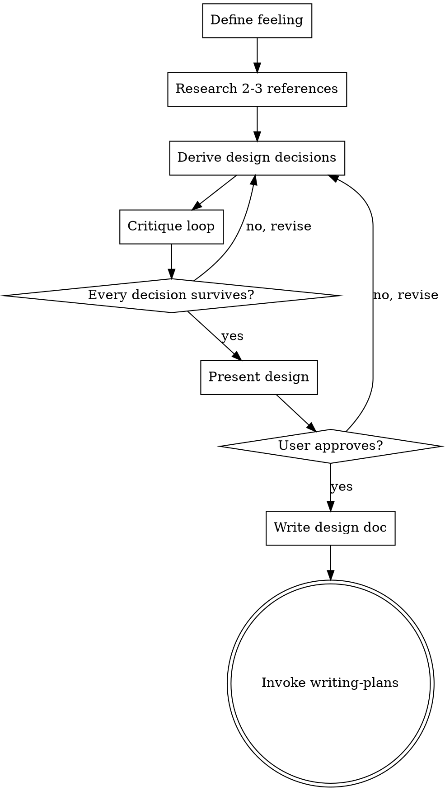

# Designing User Interfaces

## Overview

Feeling-first UI/UX design. Start from how the experience should feel, research how others solved the problem, derive specific visual and interaction decisions, then critique until every choice earns its place.

<HARD-GATE>
Do NOT skip research. Even for small designs.
Do NOT skip the critique loop.
Do NOT produce implementation code. Writing-plans handles implementation.
Do NOT present a design without a feeling statement.
</HARD-GATE>

## Design Philosophy

### General

**Beauty is alignment.** Form and function so matched the result feels inevitable.

**Elegance is complexity made invisible.** The user feels ease, never the hard problem underneath.

**Craft is invisible detail.** Spacing, transitions, alignment — details nobody notices consciously, but everyone feels. That feeling is trust.

**Restraint is courage.** Stop before the design starts explaining itself.

**Timelessness over trendiness.** Proportion and hierarchy don't age. Trends do.

### The Controller

**Calm control.** Orchestrating agents should feel like conducting — powerful, composed, unhurried. The interface makes complex orchestration feel simple, not hide the complexity.

**The tool disappears.** The best state is when you forget you're using an interface and just work.

**Terminal-native, not terminal-cosplay.** Dense, keyboard-first, no hand-holding. But what terminals would look like if redesigned today.

## Process

You MUST follow these steps in order:

1. **Define the feeling** — One sentence. What should this feel like to use? This is the north star that every subsequent decision is measured against.

2. **Research** — Find 2-3 apps/tools that solve a similar UX problem. Use web search. For each:
   - What it is and what problem it solves
   - What works well and why
   - What doesn't work or wouldn't fit The Controller

3. **Derive the design** — From feeling + research, make specific decisions about:
   - Layout and spatial relationships
   - Information hierarchy (what gets attention first, second, third)
   - Interaction model (keyboard/mouse, transitions)
   - Visual treatment (Catppuccin Mocha tokens, typography, spacing)
   - States (empty, loading, error, populated, edge cases)

4. **Critique loop** — Challenge each decision:
   - Does this serve the feeling?
   - Is there a simpler way?
   - What would you remove and still have it work?
   - Does it feel cohesive with the rest of the app?
   Revise until every decision survives.

5. **Present design** — Walk through section by section, get user approval.

6. **Write design doc** — Save to `docs/plans/YYYY-MM-DD-<topic>-design.md`, commit.

7. **Invoke writing-plans** — Hand off to implementation planning.



**Terminal state is invoking writing-plans.** Do NOT invoke any other skill.

## Design Lenses

Run every design choice through these:

- **Eye movement** — Where does the eye land first? Is that the most important thing?
- **Negative space** — Is the emptiness intentional? Grouping, breathing room, or focus?
- **Visual weight** — Which elements feel heavy? Does weight match hierarchy?
- **Contrast as communication** — Color, size, weight differences tell the user what matters. Saying the right things?
- **Edge cases as design inputs** — 1 item? 50 items? 200-character name? Error? These reveal if the design works.
- **Motion as meaning** — Animation answers "what just happened?" If not, remove it.
- **Density vs. cognitive load** — Dense + flat = overwhelming. Dense + structured = powerful.
- **The glance test** — Half-second view. What do they understand?
- **Consistency as trust** — Same patterns repeating predictably. User stops thinking about the interface.

## Principles

1. **Feeling is the north star** — Every decision traces back to the feeling statement.
2. **Research before inventing** — Always look at how others solved it first.
3. **Coherence with the whole** — New designs must feel like they belong in The Controller.
4. **Remove until it breaks** — Don't ask "is this simple enough?" Ask "what happens if I remove this?" If nothing, remove it.
5. **Specify or it didn't happen** — "Clean layout with good spacing" is worthless. Say which elements, what spacing, which tokens.

## Design Doc Format

```
# <Feature> Design

## Feeling
One sentence.

## Research
For each reference (2-3):
- What it is
- What works and why
- What doesn't or wouldn't fit

## Design

### Layout
Spatial relationships, positioning, sizing.

### Hierarchy
What gets attention first. Typography, color, spacing.

### Interactions
Keyboard, mouse, transitions, animations.

### Visual Treatment
Catppuccin Mocha tokens, spacing values, typography.

### States
Empty, loading, populated, error, edge cases.

## Critique
Decisions challenged and why they survived. What was removed.
```

Scaled to complexity.

## Red Flags — STOP and Revise

- Designing without a feeling statement
- No research references cited
- Vague specs ("good spacing", "clean layout", "nice colors")
- Skipping states (empty, error, loading)
- No critique section in the design doc
- Copying a reference wholesale instead of synthesizing
